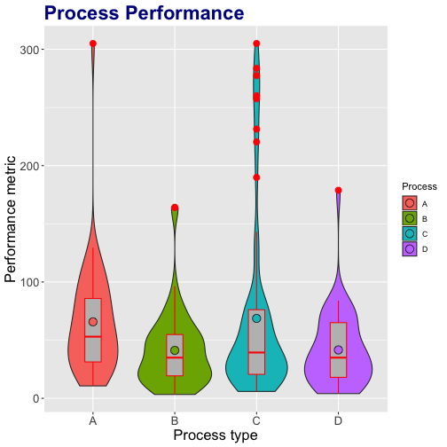
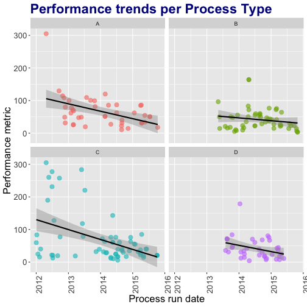

## Process Analysis

*A Developing Data Products Assignment Project*

---

## Process Analysis App

.fragment to get the overview of statistical parameters

.fragment to transform the data

.fragment to select time range

.fragment to view the distribution and scatterplots

.fragment to test for means equality

.fragment to test for trend change over time

 

.fragment <small><q>Process Analysis App just does this. It helps to __analyze__ and __compare__ functionally equivalent processes.</q></small>

---

## Analyze data in two domains

*** {name: left}
Population

*** {name: right}
Time

---

## Review some selected statistics in a tabular form

<iframe src="example.html" STYLE="width:100%" height="400"> </iframe>

<small>The table is live, check it out!</small>

---

## Where to find the stuff?

<ul style="list-style-type:circle">
    <li><a href="https://marioem.shinyapps.io/ProcessAnalysis/">Process Analysis App</a></li>
    <li><a href="https://github.com/marioem/DevelopingDataProducts/tree/master">App code on GitHub</a></li>
    <li><a href="https://github.com/marioem/DDP_Presentation_R">Presentation code on GitHub</a></li>
</ul>
 

*A simple documentation about the app is embedded in the app itself*

